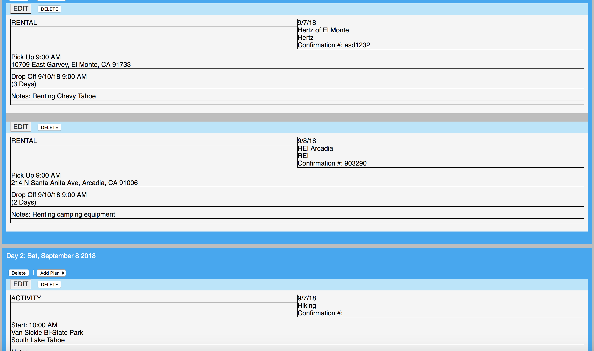

## Table of Contents

- [Description of App](#description)
- [Link to deplyed version](#deployed-version)
- [Screenshots of my App](#screenshots)
- [Description of my tech stack](#tech-stack)
- [Brief description of where each of the key parts of your project live in your codebase](#key-parts)

## Description

Itinerary Planner is designed to keep your travel plans logged in a convenient spot where you can organize thoughts and users can edit plans that they have on their travels. Be it vactioning or work-related travels, Itinerary Planner will keep and store the data that you need. Currently there are no plans for the app to be re-used by other developers.

Work In Progress features...
  - Interactive itinerary sharing
  - Suggestive Locations
  - Map Integration

Test User account with some trips already created:
  - username: testuser
  - password: helloworld

## Deployed Version

You can fine a live version:
https://itinerary-planner.netlify.com/

## Screenshots

## Tech Stack

The client side is created using React and the server side is created using Node.js. The app uses MongoDB to store the data. 

Here is a link to [server-side](https://github.com/richart14/travel-app-server) and [client-side](https://github.com/richart14/travel-app-client)

## Key Parts

- Landing Page and Registration
  Keeps them in the login page and access to the registration page. We keep auth tokens and save it to local storage allowing for immediate access of your itinerary information.

- Trip Form and Trip List
  This page acts as my psudo dashboard where you can add itineraries and modify existing ones so that you can keep your information organzied. It uses redux to connect to the store to access the state with all the itineraries.

- Single Trip Page
  Allows you to see the different plans and days that you have for each individdual trip. I decided to have the database populate the plans and days and just modified the state in the store with a single `trip`

